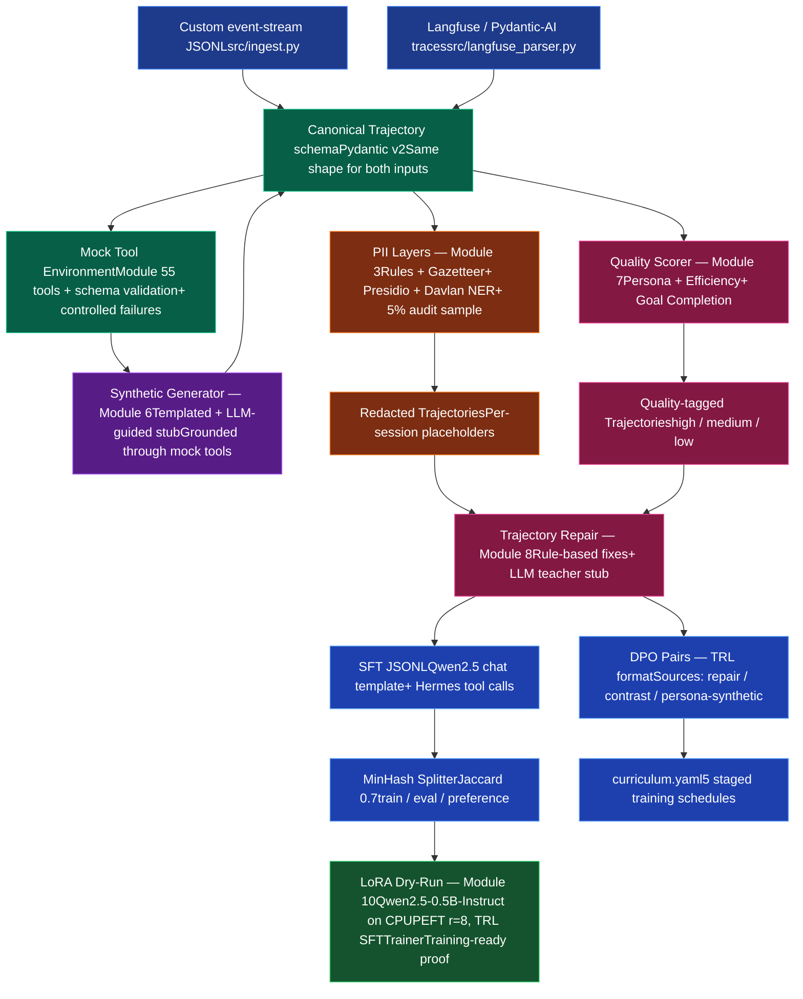
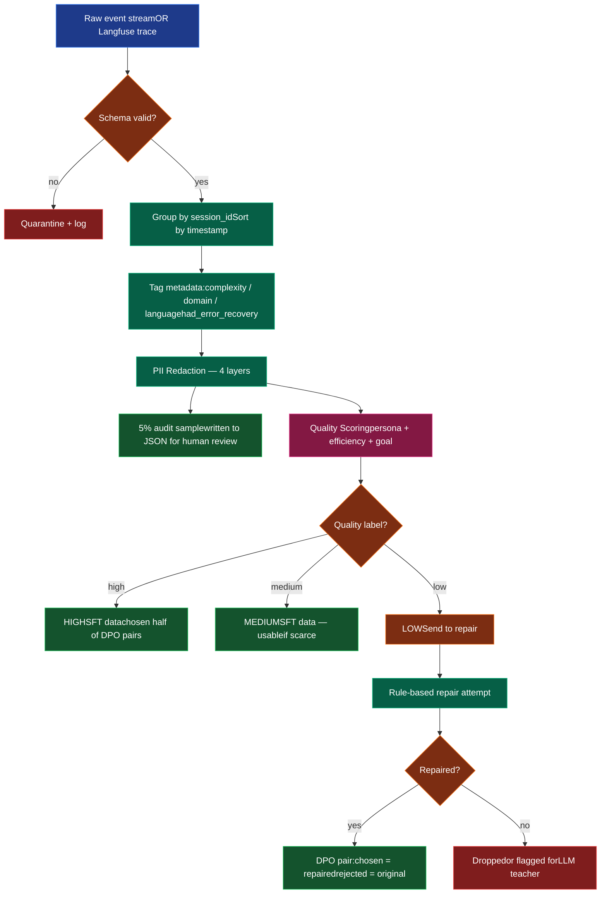

# OpenAgriNet Data Pipeline

> A production-minded data pipeline that ingests agricultural agent logs, strips Indian-context PII, generates diverse synthetic training data through grounded mock tools, scores quality against a swappable persona spec, and exports both LoRA-ready SFT JSONL and TRL-compatible DPO preference pairs — with a passing LoRA dry-run on Qwen2.5 proving the data is training-ready end-to-end.

Built by **Vaibhav Mishra** for the C4GT DMP 2026 ticket *"Build the pipeline that converts logs into training data setup"* under [COSS](https://github.com/CivicDataLab) / OpenAgriNet.

This is my implementation-first prototype: I wanted to come to the proposal with something concrete that proves I understand the problem, not just a plan.

---

## Why I built this

I read through the ticket carefully and then re-read every comment Gautam left in the discussion thread. A few things stood out to me as the real priorities, distinct from a generic data-pipeline ticket:

1. **Data creation matters more than the trainer.** Gautam said this explicitly — focus on extracting high-quality, diverse data from logs, not just plumbing logs through to a trainer.
2. **Multilingual is the real fine-tuning goal.** Agri-bot users speak Hindi, Hinglish, Devanagari, regional languages. PII detection that only handles English is half-built.
3. **The mock tool environment matters.** Without it, synthetic generation hallucinates. With it, every tool call in synthesized data is grounded against a real schema.
4. **Persona adherence and tool-call efficiency are real quality signals**, not nice-to-haves. Replies that don't match the persona or that loop on tool calls are bad data.
5. **Hard examples are valuable.** Failed trajectories shouldn't just be dropped — they should be repaired by a teacher and become preference pairs.

I built this in roughly 5 days, module by module. Each module is independently runnable and committed separately so the git history reads as steady progress.

---

## What's working

| # | Module | What it does | Files |
|---|--------|-------------|-------|
| 1 | **Schemas + Ingest** | Pydantic v2 schemas for events and trajectories. Streams raw logs, validates each event, quarantines malformed records, groups by session, sorts by timestamp, computes complexity/domain/language metadata. | `src/schemas.py`, `src/ingest.py` |
| 2 | **Synthetic Logs** | 300 sessions across 5 agri workflows (irrigation, pest, mandi-price, PM-Kisan, crop calendar) with 6 trajectory types: happy / clarify / recovery / codemix / inconsistent. | `scripts/generate_synthetic_logs.py` |
| 3 | **Multilingual PII Pipeline** | Four layers: (a) Indian regex with Verhoeff-validated Aadhaar, +91 phone variants, India-bbox GPS, PAN/IFSC, (b) curated gazetteer of 212 names + 145 villages, (c) Presidio with gazetteer cross-reference + Hinglish stopword filter, (d) Davlan multilingual NER for Devanagari. Per-session consistent placeholders, 5% audit sampling, documented residual risk. | `src/pii.py`, `data/gazetteers/`, `docs/pii_residual_risk.md` |
| 4 | **Langfuse Parser** | Boundary adapter that converts production Langfuse / Pydantic-AI traces (with `user_question`, `bot_response`, `agent_turns` structure) into my canonical Trajectory schema. The rest of the pipeline doesn't change. | `src/langfuse_schema.py`, `src/langfuse_parser.py` |
| 5 | **Mock Tool Environment** | 5 production-shape tools (`mandi_prices`, `weather_forecast`, `fetch_agristack_data`, `soil_test_report`, `govt_scheme_lookup`) with per-tool argument schemas, India-realistic mock responses, and controlled failure injection (timeout, no_data, invalid_args). CLI runner so the mentor can verify any tool standalone. | `src/mock_tools.py` |
| 6 | **Synthetic Trajectory Generator** | Two strategies. Templated synthesis (11 templates × difficulty knobs × languages = 200 trajectories instantly, no LLM). LLM-guided synthesis (env-gated stub for when a local Qwen 7B is available). Both go through the Mock Tool Environment, so every tool call is grounded. | `src/synthesis/builder.py`, `src/synthesis/templated.py`, `src/synthesis/llm_guided.py` |
| 7 | **Quality Scorer + Persona Judge** | Heuristic scorer over three dimensions: persona adherence (citation, currency, language match, hard rules), tool efficiency (step count, retry loops, recovery), goal completion (query-to-reply token overlap). Each score comes with a rationale list — fully explainable. Persona spec lives in `config/persona.md` and is swappable without code changes. LLM-judge stub for higher-fidelity scoring on the medium tier. | `src/quality/scorer.py`, `src/quality/llm_judge.py`, `config/persona.md` |
| 8 | **Trajectory Repair** | Rule-based: identifies `low`-quality trajectories and applies targeted fixes — synthesize replies from tool data when original said "don't know", trim retry loops, add tool citations, add Devanagari acknowledgment for language mismatches. LLM-teacher repair stub for cases rules can't handle. | `src/repair/rule_based.py`, `src/repair/llm_repair.py` |
| 9 | **SFT + DPO Export** | SFT JSONL formatted for Qwen2.5-Instruct chat template (Hermes-style tool calls). MinHash LSH near-duplicate detection at Jaccard 0.7 to prevent leakage across train / eval / preference splits. DPO pair construction from 3 sources: repair pairs (before/after fix), quality contrast (high vs low same domain), persona-synthetic (deliberately violated replies). | `src/export_sft.py`, `src/splitter.py`, `scripts/export_dpo.py` |
| 10 | **Curriculum + LoRA Dry-Run** | `curriculum.yaml` ships alongside the dataset — 5 stages from tool-syntax to persona-DPO that a trainer can consume directly. LoRA dry-run actually loads Qwen2.5-0.5B-Instruct on CPU, attaches LoRA adapters via PEFT (540K trainable params, 0.109% of total), runs TRL's SFTTrainer for 2 steps on 10 samples — passes cleanly, proving the data is training-ready. | `config/curriculum.yaml`, `scripts/lora_dryrun.py` |

---

## Architecture mind-map
## Architecture mind-map

How the pieces fit together — production logs and synthetic data flow through the same canonical schema, so downstream modules don't care which input they got:




## Decision-flow mind-map: one trajectory's journey
What happens to a single trajectory as it travels from raw log to training data:



How to update your README
Option A: Qui

## Quick start — reproducing my results end-to-end

The mentor or anyone evaluating can reproduce everything below. Total time on a laptop: about 15 minutes the first time (model downloads), under 5 minutes on every subsequent run.

### Prerequisites

- **Python 3.11 or 3.12** (I used 3.12)
- **Linux or macOS or WSL2** (I built this on WSL2 Ubuntu over Windows)
- ~3 GB of free disk space for cached models (Qwen tokenizer, en_core_web_lg, Davlan NER)
- An internet connection for the first run to download models from HuggingFace Hub

I do NOT need a GPU. The LoRA dry-run runs on CPU.

### Step 1: Clone and set up the environment

```bash
git clone https://github.com/vaibhav45sktech/Coss-project.git openagrinet
cd openagrinet

python3 -m venv venv
source venv/bin/activate

pip install --upgrade pip
pip install -r requirements.txt

# spaCy model used by Presidio
pip install https://github.com/explosion/spacy-models/releases/download/en_core_web_lg-3.7.1/en_core_web_lg-3.7.1-py3-none-any.whl
```

If the spaCy model URL above 404s (model versions occasionally shift), this works as a fallback:
```bash
python -m spacy download en_core_web_lg
```

### Step 2: Run the entire pipeline end-to-end

This is the one command that demonstrates everything:

```bash
bash scripts/demo.sh
```

It runs: synthetic log generation → ingest → PII redaction → quality scoring → SFT export → MinHash split → DPO pair export → LoRA dry-run.

On first run, expect about 15 minutes (mostly model downloads for Qwen tokenizer, Davlan NER, en_core_web_lg). On subsequent runs, expect under 5 minutes.

The final line of output, if everything worked, is:
✅ LoRA dry-run passed — SFT JSONL is training-ready

### Step 3: Run modules individually (optional, for deeper inspection)

Each module has a standalone runner. I run them in this order during development:

```bash
# 1. Synthetic logs (300 sessions, 5 workflows)
python -m scripts.generate_synthetic_logs

# 2. Ingest into canonical Trajectories
python -m src.ingest \
    --input data/synthetic_logs/raw_logs.jsonl \
    --output data/processed/trajectories.jsonl

# 3. Langfuse-format parser (proves production log format works)
python -m src.langfuse_parser \
    --input data/synthetic_logs/langfuse_traces.jsonl \
    --output data/processed/trajectories_from_langfuse.jsonl

# 4. PII redaction with 4 layers (rules + gazetteer + Presidio + Davlan NER)
python -m scripts.run_pii

# 5. Mock tools (CLI runner)
python -m src.mock_tools --list
python -m src.mock_tools --tool weather_forecast \
    --args '{"latitude": 19.066, "longitude": 77.174, "days": 3}'
python -m src.mock_tools --tool weather_forecast \
    --args '{"latitude": 19.0, "longitude": 73.0}' \
    --force-failure timeout

# 6. Templated synthetic trajectory generation (200 grounded trajectories)
python -m src.synthesis.templated --n 200

# 7. Quality scoring with persona adherence
python -m scripts.score_quality \
    --input data/processed/trajectories_redacted.jsonl \
    --output data/processed/quality_reports.jsonl \
    --tag-trajectories data/processed/trajectories_quality_tagged.jsonl

# 8. Repair smoke test
python -m src.repair.rule_based

# 9. SFT export with Qwen chat template
python -m src.export_sft \
    --input data/processed/trajectories_quality_tagged.jsonl \
    --output data/exports/sft_all.jsonl

# 10. MinHash splitter
python -m src.splitter \
    --input data/exports/sft_all.jsonl \
    --output-dir data/exports/

# 11. DPO pair export
python -m scripts.export_dpo \
    --input data/processed/trajectories_quality_tagged.jsonl \
    --output data/exports/dpo_pairs.jsonl

# 12. LoRA dry-run on Qwen2.5-0.5B-Instruct
python scripts/lora_dryrun.py
```

### Step 4: Spot-check the multilingual PII layer

This is the demo I'd want to show the mentor first because it directly addresses the "multilingual is the real fine-tuning goal" point in the thread:

```bash
python -c "
from src.pii import PIIPipeline
pipeline = PIIPipeline(use_indicner=True)
text = 'मेरा नाम रमेश है और मैं नासिक जिले से हूं।'
matches = pipeline.detect(text, language_hint='hi')
print(f'Text: {text}')
for m in matches:
    print(f'  {m.pii_type}: {m.original!r} (conf={m.confidence:.2f}, source={m.source})')
"
```

Expected output:
NAME: 'रमेश' (conf=1.00, source=multilingual_ner)
LOCATION: 'नासिक जिले' (conf=1.00, source=multilingual_ner)

Without the multilingual NER layer, the same input returns 0 matches — the gazetteer and Presidio are English-only.

---

## How I think about the design choices

A few decisions I want to call out because I think they matter for the project's longer arc:

**1. I separated detection from redaction in the PII pipeline.** Each layer (rules, gazetteer, Presidio, Davlan NER) just emits `PIIMatch` objects with spans and confidence. The pipeline class is the one that dedupes overlapping matches, picks the higher-confidence layer when they conflict, and applies consistent per-session placeholders. This means adding a 5th layer later (or swapping Davlan for AI4Bharat's gated IndicNER) is a one-class change.

**2. The Mock Tool Environment is a real first-class module, not an afterthought.** I built it before the synthetic generator because I want every synthesized tool call to be grounded — never a hallucinated `{"price": 9999}` because the LLM made it up. The mock executor validates args against schemas before returning, and can be forced into specific failure modes for generating error-recovery training data.

**3. I committed to two synthesis strategies but only fully implemented one.** Templated synthesis (no LLM) is reliable, instant, deterministic under a seed. LLM-guided synthesis is designed, env-gated, and stubbed — when a local Qwen 7B is available, set `USE_LLM=1` and one env var for the endpoint, no code change needed. This was a deliberate choice: ship a working baseline now, leave the headroom for the GPU-backed version when production hardware is available.

**4. The persona spec lives in `config/persona.md`, not in Python.** Gautam mentioned swappable rubrics in the thread. Edit the markdown, no code change — the heuristic scorer reads the file at startup and the LLM judge passes it into the prompt.

**5. DPO pairs come from three sources, not one.** Repair pairs are the cleanest signal (same trajectory before/after fix). Quality contrast pairs match high-quality and low-quality trajectories in the same domain. Persona-synthetic pairs deliberately corrupt high-quality replies (USD currency instead of ₹, generic non-action, missing citation). Each pair carries `source` in metadata so a trainer can weight or filter.

**6. `curriculum.yaml` ships alongside the dataset.** A trainer can read 5 stages — tool syntax, multi-tool, complex agentic, multilingual robustness, persona DPO — and apply them sequentially without ever touching pipeline code. This is the "complexity tags map to training schedules" line from the ticket made concrete.

---

